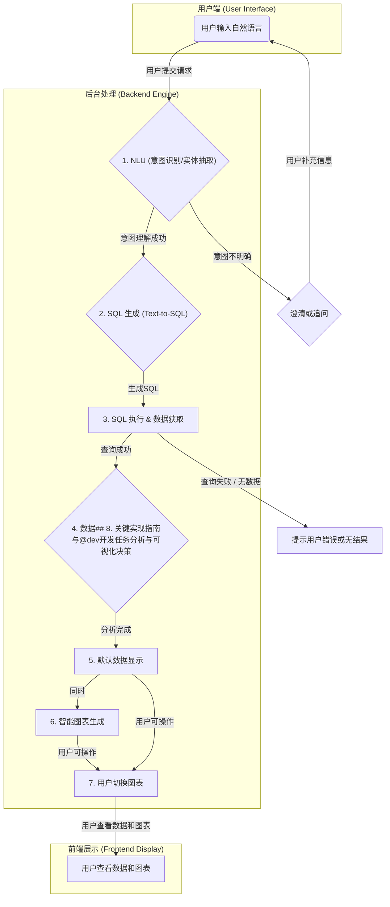

# DataLingua 架构文档

## 1. 项目简介

DataLingua 是一个数据库自然语言接口系统，支持用户用中文自然语言查询业务数据，自动完成意图识别、实体抽取、SQL 生成、数据库查询、数据分析与可视化等全流程。

- **核心目标**：让业务用户无需懂 SQL，即可用自然语言获取所需数据和图表。
- **主要用户**：业务分析师、运营、管理层等。

---

## 2. 系统架构总览

### 2.1 架构流程图



### 8.1 核心开发优先级

**Phase 1: 核心MVP实现**
```python
# @dev 任务1: 实现基础NLU节点
def intelligent_nlu_node(state: EnhancedGraphState) -> EnhancedGraphState:
    """
    集成要求：
    1. 调用本地Ollama Llama3模型
    2. 严格按照nlu.md格式构造prompt
    3. 解析返回的JSON，填充ExtractedEntities
    4. 计算置信度，低于0.8时触发澄清机制
    
    测试用例：
    - "我想看过去三个月，每个销售区域的销售额和利润分别是多少？"
    - "查一下销售额"（缺少时间和维度，应触发澄清）
    """
    import ollama
    import json
    from datetime import datetime
    import re
    
    state['status'] = QueryStatus.NLU_PROCESSING
    state['start_time'] = datetime.now().timestamp()
    
    try:
        user_query = state['original_question']
        
        # 构造严格按照nlu.md格式的prompt
        prompt = f"""你是一个专业的数据库自然语言接口。你的任务是分析用户的查询请求，并从中提取意图和关键实体。

# 意图定义
可识别的意图包括:
- query_data: 用户想要查询数据。

# 实体定义
你需要提取以下实体:
- metrics (指标): 用户关心的数值型数据，例如：销售额, 利润, 活跃用户数。
- dimensions (维度): 用户希望用来对数据进行分组的类别，例如：按区域, 按产品, 按时间。
- time_range (时间范围): 查询所涉及的时间段，例如：上个月, 2023年全年。
- filters (过滤条件): 对查询结果进行筛选的约束。

# 输出格式
请以JSON格式返回结果。如果缺少执行查询所必需的实体（例如，缺少时间范围），请在 'missing_entities' 字段中注明，并生成一个 'clarification_question' 来询问用户。

# 用户输入
用户: "{user_query}"

# 你的输出
请严格按照以下JSON格式返回，不要包含任何其他文字："""

        # 调用Ollama Llama3
        response = ollama.chat(model='llama3', messages=[
            {'role': 'user', 'content': prompt}
        ])
        
        # 提取JSON内容
        response_text = response['message']['content'].strip()
        
        # 尝试提取JSON（去除markdown格式）
        json_match = re.search(r'```json\s*(.*?)\s*```', response_text, re.DOTALL)
        if json_match:
            json_text = json_match.group(1)
        else:
            json_text = response_text
        
        # 解析JSON响应
        nlu_result = json.loads(json_text)
        
        # 创建ExtractedEntities对象
        entities = ExtractedEntities(
            metrics=nlu_result.get('entities', {}).get('metrics'),
            dimensions=nlu_result.get('entities', {}).get('dimensions'),
            time_range=nlu_result.get('entities', {}).get('time_range'),
            filters=nlu_result.get('entities', {}).get('filters')
        )
        
        # 计算置信度（基于实体完整性）
        confidence_score = calculate_confidence(entities)
        
        # 填充state状态
        state['intent'] = nlu_result.get('intent', 'query_data')
        state['entities'] = entities
        state['confidence_score'] = confidence_score
        state['missing_entities'] = nlu_result.get('missing_entities', [])
        state['clarification_question'] = nlu_result.get('clarification_question')
        
        # 判断是否需要澄清
        if state['missing_entities'] or confidence_score < 0.8:
            state['clarification_needed'] = True
            state['status'] = QueryStatus.NEEDS_CLARIFICATION
        else:
            state['clarification_needed'] = False
            state['status'] = QueryStatus.SQL_GENERATING
            
        # 记录处理时间
        if 'processing_time' not in state:
            state['processing_time'] = {}
        state['processing_time']['nlu'] = datetime.now().timestamp() - state['start_time']
        
    except json.JSONDecodeError as e:
        state['error_message'] = f"NLU响应JSON解析失败: {str(e)}"
        state['error_code'] = 'JSON_PARSE_ERROR'
        state['status'] = QueryStatus.FAILED
    except Exception as e:
        state['error_message'] = f"NLU处理失败: {str(e)}"
        state['error_code'] = 'NLU_PROCESSING_ERROR'
        state['status'] = QueryStatus.FAILED
    
    return state

def calculate_confidence(entities: ExtractedEntities) -> float:
    """计算NLU结果的置信度"""
    score = 0.0
    
    # 指标存在且非空
    if entities.metrics and len(entities.metrics) > 0:
        score += 0.4
    
    # 时间范围存在
    if entities.time_range:
        score += 0.3
    
    # 维度存在
    if entities.dimensions and len(entities.dimensions) > 0:
        score += 0.2
    
    # 基础分数
    score += 0.1
    
    return min(score, 1.0)

def text_to_sql_node(state: EnhancedGraphState, db_schema: str) -> EnhancedGraphState:
    """
    集成要求：
    1. 加载defog/sqlcoder-7b-2模型
    2. 构造包含schema的prompt
    3. 生成并验证SQL语法
    4. 记录生成时间和token消耗
    """
    from transformers import AutoTokenizer, AutoModelForCausalLM
    import torch
    from datetime import datetime
    import re
    
    try:
        start_time = datetime.now().timestamp()
        state['status'] = QueryStatus.SQL_GENERATING
        
        # 加载SQLCoder模型（实际部署时应该预加载）
        model_name = "defog/sqlcoder-7b-2"
        tokenizer = AutoTokenizer.from_pretrained(model_name)
        model = AutoModelForCausalLM.from_pretrained(
            model_name, 
            torch_dtype=torch.float16,
            device_map="auto"
        )
        
        # 构造SQLCoder prompt
        entities = state['entities']
        user_question = state['original_question']
        
        # 构建结构化查询描述
        query_desc = build_query_description(entities, user_question)
        
        prompt = f"""### Task
Generate a SQL query to answer the following question about a database.

### Database Schema
{db_schema}

### Question
{user_question}

### Query Requirements
{query_desc}

### SQL Query
SELECT"""
        
        # 生成SQL
        inputs = tokenizer.encode(prompt, return_tensors="pt")
        
        with torch.no_grad():
            outputs = model.generate(
                inputs,
                max_length=inputs.shape[1] + 200,
                temperature=0.1,
                do_sample=True,
                pad_token_id=tokenizer.eos_token_id
            )
        
        # 解码生成的SQL
        generated_text = tokenizer.decode(outputs[0], skip_special_tokens=True)
        sql_query = extract_sql_from_response(generated_text, prompt)
        
        # 验证SQL语法
        if validate_sql_syntax(sql_query):
            state['sql_query'] = sql_query
            state['status'] = QueryStatus.SQL_EXECUTING
        else:
            state['error_message'] = "生成的SQL语法无效"
            state['error_code'] = 'INVALID_SQL_SYNTAX'
            state['status'] = QueryStatus.FAILED
        
        # 记录处理时间
        if 'processing_time' not in state:
            state['processing_time'] = {}
        state['processing_time']['sql_generation'] = datetime.now().timestamp() - start_time
        
    except Exception as e:
        state['error_message'] = f"SQL生成失败: {str(e)}"
        state['error_code'] = 'SQL_GENERATION_ERROR'
        state['status'] = QueryStatus.FAILED
    
    return state

def build_query_description(entities: ExtractedEntities, user_question: str) -> str:
    """构建查询描述"""
    desc_parts = []
    
    if entities.metrics:
        desc_parts.append(f"- Select metrics: {', '.join(entities.metrics)}")
    
    if entities.dimensions:
        desc_parts.append(f"- Group by dimensions: {', '.join(entities.dimensions)}")
    
    if entities.time_range:
        desc_parts.append(f"- Filter by time range: {entities.time_range}")
    
    if entities.filters:
        desc_parts.append(f"- Apply filters: {', '.join(entities.filters)}")
    
    return '\n'.join(desc_parts) if desc_parts else "- General data query"

def extract_sql_from_response(generated_text: str, prompt: str) -> str:
    """从生成的文本中提取SQL查询"""
    # 移除prompt部分
    sql_part = generated_text[len(prompt):].strip()
    
    # 添加SELECT前缀（因为prompt已包含SELECT）
    sql_query = "SELECT" + sql_part
    
    # 清理SQL（移除多余的文本）
    sql_lines = []
    for line in sql_query.split('\n'):
        line = line.strip()
        if line and not line.startswith('#') and not line.startswith('--'):
            sql_lines.append(line)
        if line.endswith(';'):
            break
    
    return '\n'.join(sql_lines)

def validate_sql_syntax(sql: str) -> bool:
    """基础SQL语法验证"""
    if not sql or not sql.strip():
        return False
    
    sql_upper = sql.upper().strip()
    
    # 必须以SELECT开头
    if not sql_upper.startswith('SELECT'):
        return False
    
    # 不能包含危险关键词
    dangerous_keywords = ['DROP', 'DELETE', 'UPDATE', 'INSERT', 'CREATE', 'ALTER', 'TRUNCATE']
    for keyword in dangerous_keywords:
        if keyword in sql_upper:
            return False
    
    # 基本语法检查：括号匹配
    if sql.count('(') != sql.count(')'):
        return False
    
    return True

def secure_sql_execution_node(state: EnhancedGraphState) -> EnhancedGraphState:
    """
    安全要求：
    1. SQL白名单检查（只允许SELECT开头）
    2. 禁止危险关键词（DELETE, UPDATE, DROP等）
    3. 查询超时设置（30秒）
    4. 结果集大小限制（10000行）
    5. 连接池管理，避免连接泄露
    """
    import re
    import signal
    import threading
    import time
    from datetime import datetime
    import pymysql
    import psycopg2
    from contextlib import contextmanager
    
    sql = state.get('sql_query', '').strip()
    database = state.get('database', 'default')
    
    # 安全检查
    if not sql.upper().startswith('SELECT'):
        state['error_message'] = '只允许SELECT查询'
        state['error_code'] = 'INVALID_OPERATION'
        state['status'] = QueryStatus.FAILED
        return state
    
    # 危险关键词检查
    dangerous_keywords = ['DELETE', 'UPDATE', 'INSERT', 'DROP', 'CREATE', 'ALTER', 'TRUNCATE', 'EXEC', 'EXECUTE']
    sql_upper = sql.upper()
    for keyword in dangerous_keywords:
        if re.search(r'\b' + keyword + r'\b', sql_upper):
            state['error_message'] = f'包含禁止的SQL关键词: {keyword}'
            state['error_code'] = 'SECURITY_VIOLATION'
            state['status'] = QueryStatus.FAILED
            return state
    
    # 子查询中的写操作检查
    if re.search(r'\b(DELETE|UPDATE|INSERT|DROP|CREATE|ALTER)\b', sql_upper):
        state['error_message'] = '查询中包含禁止的写操作'
        state['error_code'] = 'SECURITY_VIOLATION'
        state['status'] = QueryStatus.FAILED
        return state
    
    try:
        start_time = datetime.now().timestamp()
        state['status'] = QueryStatus.SQL_EXECUTING
        
        # 获取数据库连接配置
        db_config = get_database_config(database)
        
        # 执行查询（带超时控制）
        result = execute_query_with_timeout(sql, db_config, timeout=30)
        
        # 检查结果集大小
        if len(result['data']) > 10000:
            state['error_message'] = f'结果集过大({len(result["data"])}行)，请添加更多筛选条件'
            state['error_code'] = 'RESULT_TOO_LARGE'
            state['status'] = QueryStatus.FAILED
            return state
        
        # 转换为标准格式
        formatted_results = []
        for row in result['data']:
            if isinstance(row, (list, tuple)):
                row_dict = dict(zip(result['columns'], row))
            else:
                row_dict = dict(row)
            formatted_results.append(row_dict)
        
        state['raw_results'] = {
            'columns': result['columns'],
            'data': formatted_results,
            'row_count': len(formatted_results)
        }
        state['status'] = QueryStatus.RESULT_PROCESSING
        
        # 记录性能指标
        execution_time = datetime.now().timestamp() - start_time
        if 'processing_time' not in state:
            state['processing_time'] = {}
        state['processing_time']['sql_execution'] = execution_time
        
        # 记录慢查询
        if execution_time > 5.0:
            log_slow_query(sql, execution_time, database)
        
    except TimeoutError:
        state['error_message'] = '查询执行超时(30秒)，请优化查询或添加索引'
        state['error_code'] = 'QUERY_TIMEOUT'
        state['status'] = QueryStatus.FAILED
    except Exception as e:
        state['error_message'] = f'SQL执行失败: {str(e)}'
        state['error_code'] = 'SQL_EXECUTION_ERROR'
        state['status'] = QueryStatus.FAILED
    
    return state

def get_database_config(database: str) -> dict:
    """获取数据库配置"""
    # 这里应该从配置文件或环境变量读取
    configs = {
        'default': {
            'type': 'mysql',
            'host': 'localhost',
            'port': 3306,
            'user': 'readonly_user',
            'password': 'readonly_pass',
            'database': 'business_db'
        }
    }
    return configs.get(database, configs['default'])

def execute_query_with_timeout(sql: str, db_config: dict, timeout: int = 30) -> dict:
    """带超时控制的查询执行"""
    result = {'columns': [], 'data': []}
    exception_holder = [None]
    
    def query_worker():
        try:
            if db_config['type'] == 'mysql':
                conn = pymysql.connect(
                    host=db_config['host'],
                    port=db_config['port'],
                    user=db_config['user'],
                    password=db_config['password'],
                    database=db_config['database'],
                    charset='utf8mb4'
                )
                with conn.cursor() as cursor:
                    cursor.execute(sql)
                    result['columns'] = [desc[0] for desc in cursor.description]
                    result['data'] = cursor.fetchall()
                conn.close()
                
            elif db_config['type'] == 'postgresql':
                conn = psycopg2.connect(
                    host=db_config['host'],
                    port=db_config['port'],
                    user=db_config['user'],
                    password=db_config['password'],
                    database=db_config['database']
                )
                with conn.cursor() as cursor:
                    cursor.execute(sql)
                    result['columns'] = [desc[0] for desc in cursor.description]
                    result['data'] = cursor.fetchall()
                conn.close()
                
        except Exception as e:
            exception_holder[0] = e
    
    # 启动查询线程
    thread = threading.Thread(target=query_worker)
    thread.daemon = True
    thread.start()
    thread.join(timeout)
    
    if thread.is_alive():
        # 查询超时，强制终止（注意：实际生产环境需要更优雅的处理）
        raise TimeoutError(f"查询执行超过{timeout}秒")
    
    if exception_holder[0]:
        raise exception_holder[0]
    
    return result

def log_slow_query(sql: str, execution_time: float, database: str):
    """记录慢查询日志"""
    import logging
    
    logger = logging.getLogger('datalingua.slow_query')
    logger.warning(f"慢查询detected - Database: {database}, Time: {execution_time:.2f}s, SQL: {sql[:200]}...")
```

**Phase 2: 企业级功能**
```python
class MultiLevelCacheManager:
    def __init__(self):
        self.l1_cache = {}  # 内存缓存
        import redis
        self.l2_redis = redis.Redis(host='localhost', port=6379, db=0, decode_responses=True)
        self.cache_stats = {'l1_hits': 0, 'l2_hits': 0, 'misses': 0}
        self.l1_max_size = 1000  # L1缓存最大条目数
        self.l1_size_limit = 1024 * 1024  # L1缓存单个条目最大1MB
    
    def get_cached_result(self, cache_key: str) -> Optional[dict]:
        """
        实现要求：
        1. L1缓存查询（毫秒级）
        2. L2 Redis查询（10ms内）
        3. 缓存命中率统计
        4. 缓存键冲突处理
        """
        import json
        import sys
        
        # L1缓存查询
        if cache_key in self.l1_cache:
            self.cache_stats['l1_hits'] += 1
            return self.l1_cache[cache_key]['data']
        
        # L2 Redis缓存查询
        try:
            cached_data = self.l2_redis.get(cache_key)
            if cached_data:
                result = json.loads(cached_data)
                self.cache_stats['l2_hits'] += 1
                
                # 将热门数据提升到L1缓存
                data_size = sys.getsizeof(cached_data)
                if data_size <= self.l1_size_limit:
                    self._promote_to_l1(cache_key, result)
                
                return result
        except Exception as e:
            print(f"Redis缓存查询失败: {e}")
        
        # 缓存未命中
        self.cache_stats['misses'] += 1
        return None
    
    def cache_result(self, cache_key: str, result: dict, ttl: int = 3600):
        """
        缓存策略：
        1. 小结果集（<1MB）存储到L1+L2
        2. 大结果集（>1MB）只存储到L2
        3. 热门查询自动延长TTL
        """
        import json
        import sys
        
        try:
            # 序列化数据
            serialized_data = json.dumps(result, ensure_ascii=False)
            data_size = sys.getsizeof(serialized_data)
            
            # 存储到L2 Redis缓存
            self.l2_redis.setex(cache_key, ttl, serialized_data)
            
            # 小数据存储到L1缓存
            if data_size <= self.l1_size_limit:
                self._store_to_l1(cache_key, result)
            
        except Exception as e:
            print(f"缓存存储失败: {e}")
    
    def _promote_to_l1(self, cache_key: str, data: dict):
        """将数据提升到L1缓存"""
        import time
        
        # L1缓存容量控制
        if len(self.l1_cache) >= self.l1_max_size:
            self._evict_l1_cache()
        
        self.l1_cache[cache_key] = {
            'data': data,
            'access_time': time.time(),
            'access_count': 1
        }
    
    def _store_to_l1(self, cache_key: str, data: dict):
        """存储到L1缓存"""
        import time
        
        # L1缓存容量控制
        if len(self.l1_cache) >= self.l1_max_size:
            self._evict_l1_cache()
        
        self.l1_cache[cache_key] = {
            'data': data,
            'access_time': time.time(),
            'access_count': 0
        }
    
    def _evict_l1_cache(self):
        """L1缓存淘汰策略（LRU）"""
        if not self.l1_cache:
            return
        
        # 找到最久未访问的条目
        oldest_key = min(self.l1_cache.keys(), 
                        key=lambda k: self.l1_cache[k]['access_time'])
        del self.l1_cache[oldest_key]
    
    def get_cache_stats(self) -> dict:
        """获取缓存统计信息"""
        total_requests = sum(self.cache_stats.values())
        if total_requests == 0:
            return {**self.cache_stats, 'hit_rate': 0.0}
        
        hit_rate = (self.cache_stats['l1_hits'] + self.cache_stats['l2_hits']) / total_requests
        return {
            **self.cache_stats,
            'hit_rate': hit_rate,
            'l1_size': len(self.l1_cache)
        }

class IntelligentSchemaManager:
    def __init__(self, config_path: str):
        self.schema_mappings = self._load_mappings(config_path)
        self.fuzzy_matcher = self._init_fuzzy_matcher()
        self.semantic_cache = {}
    
    def map_chinese_to_field(self, chinese_term: str) -> List[str]:
        """
        智能字段映射：
        1. 精确匹配（销售额 → sales_amount）
        2. 模糊匹配（销售 → [sales_amount, revenue, turnover]）
        3. 语义匹配（利润 → [profit, net_income, margin]）
        """
        # 缓存检查
        if chinese_term in self.semantic_cache:
            return self.semantic_cache[chinese_term]
        
        results = []
        
        # 1. 精确匹配
        if chinese_term in self.schema_mappings:
            results.append(self.schema_mappings[chinese_term])
        
        # 2. 模糊匹配
        fuzzy_matches = self._fuzzy_match(chinese_term)
        results.extend(fuzzy_matches)
        
        # 3. 语义匹配
        semantic_matches = self._semantic_match(chinese_term)
        results.extend(semantic_matches)
        
        # 去重并排序（精确匹配优先）
        unique_results = list(dict.fromkeys(results))
        
        # 缓存结果
        self.semantic_cache[chinese_term] = unique_results
        
        return unique_results
    
    def auto_discover_schema(self, db_connection) -> dict:
        """
        自动Schema发现：
        1. 获取表结构信息
        2. 分析字段类型和分布
        3. 生成中文字段映射建议
        4. 识别潜在的业务指标和维度
        """
        import pymysql
        
        discovered_schema = {
            'tables': {},
            'suggested_mappings': {},
            'metrics': [],
            'dimensions': []
        }
        
        try:
            cursor = db_connection.cursor()
            
            # 获取所有表名
            cursor.execute("SHOW TABLES")
            tables = [row[0] for row in cursor.fetchall()]
            
            for table in tables:
                # 获取表结构
                cursor.execute(f"DESCRIBE {table}")
                columns = cursor.fetchall()
                
                table_info = {
                    'columns': [],
                    'numeric_fields': [],
                    'categorical_fields': [],
                    'time_fields': []
                }
                
                for col in columns:
                    col_name, col_type, nullable, key, default, extra = col
                    
                    column_info = {
                        'name': col_name,
                        'type': col_type,
                        'nullable': nullable,
                        'key': key
                    }
                    table_info['columns'].append(column_info)
                    
                    # 字段分类
                    col_type_upper = col_type.upper()
                    if any(t in col_type_upper for t in ['INT', 'DECIMAL', 'FLOAT', 'DOUBLE']):
                        table_info['numeric_fields'].append(col_name)
                        # 推测为指标
                        if any(keyword in col_name.lower() for keyword in ['amount', 'count', 'sum', 'total', 'sales', 'revenue', 'profit']):
                            discovered_schema['metrics'].append(col_name)
                    
                    elif any(t in col_type_upper for t in ['VARCHAR', 'TEXT', 'CHAR']):
                        table_info['categorical_fields'].append(col_name)
                        # 推测为维度
                        if any(keyword in col_name.lower() for keyword in ['region', 'category', 'type', 'status', 'name']):
                            discovered_schema['dimensions'].append(col_name)
                    
                    elif any(t in col_type_upper for t in ['DATE', 'DATETIME', 'TIMESTAMP']):
                        table_info['time_fields'].append(col_name)
                        discovered_schema['dimensions'].append(col_name)
                
                discovered_schema['tables'][table] = table_info
                
                # 生成中文映射建议
                for col_name in table_info['numeric_fields']:
                    chinese_name = self._suggest_chinese_name(col_name)
                    if chinese_name:
                        discovered_schema['suggested_mappings'][chinese_name] = col_name
            
            cursor.close()
            
        except Exception as e:
            print(f"Schema自动发现失败: {e}")
        
        return discovered_schema
    
    def _load_mappings(self, config_path: str) -> dict:
        """加载字段映射配置"""
        import yaml
        import os
        
        if not os.path.exists(config_path):
            # 返回默认映射
            return {
                '销售额': 'sales_amount',
                '利润': 'profit',
                '收入': 'revenue',
                '用户数': 'user_count',
                '订单量': 'order_count',
                '区域': 'region',
                '产品': 'product',
                '时间': 'date',
                '部门': 'department'
            }
        
        try:
            with open(config_path, 'r', encoding='utf-8') as f:
                config = yaml.safe_load(f)
                return config.get('schema_mapping', {})
        except Exception as e:
            print(f"配置文件加载失败: {e}")
            return {}
    
    def _init_fuzzy_matcher(self):
        """初始化模糊匹配器"""
        try:
            from fuzzywuzzy import fuzz
            return fuzz
        except ImportError:
            return None
    
    def _fuzzy_match(self, chinese_term: str) -> List[str]:
        """模糊匹配"""
        if not self.fuzzy_matcher:
            return []
        
        matches = []
        threshold = 70  # 相似度阈值
        
        for chinese_key, english_field in self.schema_mappings.items():
            similarity = self.fuzzy_matcher.ratio(chinese_term, chinese_key)
            if similarity >= threshold:
                matches.append(english_field)
        
        return matches
    
    def _semantic_match(self, chinese_term: str) -> List[str]:
        """语义匹配"""
        semantic_groups = {
            '销售': ['sales_amount', 'revenue', 'turnover'],
            '利润': ['profit', 'net_income', 'margin'],
            '用户': ['user_count', 'customer_count', 'active_users'],
            '订单': ['order_count', 'order_amount', 'transaction_count'],
            '区域': ['region', 'area', 'location', 'zone'],
            '产品': ['product', 'item', 'goods', 'category'],
            '时间': ['date', 'time', 'period', 'month', 'year']
        }
        
        matches = []
        for key, fields in semantic_groups.items():
            if key in chinese_term:
                matches.extend(fields)
        
        return matches
    
    def _suggest_chinese_name(self, english_field: str) -> str:
        """为英文字段名建议中文名"""
        suggestions = {
            'sales_amount': '销售额',
            'revenue': '收入',
            'profit': '利润',
            'user_count': '用户数',
            'order_count': '订单量',
            'region': '区域',
            'product': '产品',
            'date': '时间',
            'department': '部门'
        }
        
        # 精确匹配
        if english_field in suggestions:
            return suggestions[english_field]
        
        # 模糊匹配
        for eng_key, chi_name in suggestions.items():
            if eng_key in english_field.lower():
                return chi_name
        
        return None
```

### 8.2 关键技术集成指南

**集成Ollama Llama3:**
```bash
# 安装和配置
curl -fsSL https://ollama.com/install.sh | sh
ollama pull llama3
```

```python
# Python集成示例
import ollama

def call_llama3_for_nlu(user_query: str) -> dict:
    prompt = f"""
    你是一个专业的数据库自然语言接口。分析用户查询并提取意图和实体。

    可识别的意图: query_data
    实体类型:
    - metrics: 销售额、利润、活跃用户数等
    - dimensions: 区域、产品、时间等
    - time_range: 过去三个月、2023年等
    - filters: 过滤条件

    用户查询: {user_query}

    返回JSON格式:
    {{
        "intent": "query_data",
        "entities": {{
            "metrics": [...],
            "dimensions": [...],
            "time_range": "...",
            "filters": [...]
        }},
        "missing_entities": [...],
        "clarification_question": "..."
    }}
    """
    
    response = ollama.chat(model='llama3', messages=[
        {'role': 'user', 'content': prompt}
    ])
    
    return json.loads(response['message']['content'])
```

**集成SQLCoder:**
```python
from transformers import AutoTokenizer, AutoModelForCausalLM

def load_sqlcoder_model():
    model_name = "defog/sqlcoder-7b-2"
    tokenizer = AutoTokenizer.from_pretrained(model_name)
    model = AutoModelForCausalLM.from_pretrained(model_name)
    return tokenizer, model

def generate_sql(nlu_result: dict, db_schema: str) -> str:
    """构造SQLCoder prompt并生成SQL"""
    from transformers import AutoTokenizer, AutoModelForCausalLM
    import torch
    
    # 构造prompt
    entities = nlu_result.get('entities', {})
    
    prompt = f"""### Task
Generate a SQL query based on the natural language question and database schema.

### Database Schema
{db_schema}

### Natural Language Question
{nlu_result.get('original_question', '')}

### Extracted Information
- Metrics: {entities.get('metrics', [])}
- Dimensions: {entities.get('dimensions', [])}
- Time Range: {entities.get('time_range', 'N/A')}
- Filters: {entities.get('filters', [])}

### Requirements
- Generate only SELECT statements
- Use proper table joins if needed
- Apply time filters based on time_range
- Group by dimensions if specified
- Aggregate metrics appropriately

### SQL Query
SELECT"""
    
    # 加载模型（生产环境中应该预加载）
    model_name = "defog/sqlcoder-7b-2"
    tokenizer = AutoTokenizer.from_pretrained(model_name)
    model = AutoModelForCausalLM.from_pretrained(model_name, torch_dtype=torch.float16)
    
    # 生成SQL
    inputs = tokenizer.encode(prompt, return_tensors="pt")
    
    with torch.no_grad():
        outputs = model.generate(
            inputs,
            max_length=inputs.shape[1] + 150,
            temperature=0.1,
            do_sample=True,
            pad_token_id=tokenizer.eos_token_id,
            eos_token_id=tokenizer.eos_token_id
        )
    
    # 解码并提取SQL
    generated_text = tokenizer.decode(outputs[0], skip_special_tokens=True)
    sql_part = generated_text[len(prompt):].strip()
    
    # 构建完整SQL
    sql_query = "SELECT" + sql_part
    
    # 清理SQL
    sql_lines = []
    for line in sql_query.split('\n'):
        line = line.strip()
        if line and not line.startswith('#') and not line.startswith('--'):
            sql_lines.append(line)
            if line.endswith(';'):
                break
    
    return '\n'.join(sql_lines)
```

### 8.3 测试与验证要求

**@dev 必须实现的测试用例:**

1. **NLU准确性测试**
   - 正常查询："过去一个月每个区域的销售额"
   - 缺失实体："查看销售额"（缺时间和维度）
   - 复杂查询："华北区域2023年Q4产品A的销售额和利润"

2. **SQL生成准确性测试**
   - 聚合查询：GROUP BY + SUM
   - 时间过滤：DATE范围查询
   - 多维度：复杂JOIN查询

3. **安全性测试**
   - SQL注入尝试：'; DROP TABLE users; --
   - 权限越界：访问未授权表
   - 资源消耗：大数据量查询

4. **性能测试**
   - 缓存命中率 > 80%
   - 平均响应时间 < 2秒
   - 并发处理能力 > 100 QPS

---

## 9. 未来架构演进路线图

### 9.1 短期优化（1-3个月）
- **模型升级**：从Llama3升级到Llama3.1，提升中文NLU准确率
- **缓存智能化**：基于查询频次和用户行为的动态缓存策略
- **监控增强**：集成Prometheus + Grafana，实现全链路性能监控
- **安全加固**：增加API限流、用户认证、操作审计

### 9.2 中期扩展（3-6个月）
- **多模态支持**：语音输入、图表交互式查询
- **智能推荐**：基于历史查询的业务洞察推荐
- **数据血缘**：查询结果溯源，数据质量评估
- **分布式架构**：支持多地域部署，数据联邦查询

### 9.3 长期愿景（6-12个月）
- **自然语言对话**：多轮对话，上下文理解
- **自动化报告**：定时生成业务报告，异常告警
- **数据治理**：数据分类分级，隐私保护合规
- **AI助手进化**：从查询工具升级为业务分析助手

---

## 10. 架构总结与核心价值

DataLingua不仅仅是一个自然语言查询工具，而是一个**企业级智能数据分析平台**：

### 10.1 技术创新点
1. **LangGraph流程编排**：复杂业务逻辑的可视化管理
2. **多级缓存架构**：毫秒级响应，支撑高并发场景
3. **智能安全框架**：多维度防护，企业级安全保障
4. **自适应优化**：基于使用模式的自动性能调优

### 10.2 业务价值体现
1. **降低门槛**：让业务人员直接用中文查询数据，无需SQL技能
2. **提升效率**：从写SQL→等待结果→分析数据，缩短为一步完成
3. **保障安全**：企业级权限控制，数据访问合规可审计
4. **智能洞察**：不仅查询数据，还提供业务建议和趋势分析

### 10.3 竞争优势
- **本地化优势**：针对中文优化，理解中国企业业务场景
- **成本优势**：本地部署Llama3，避免API调用成本
- **性能优势**：多级缓存 + 查询优化，响应速度显著优于通用方案
- **安全优势**：源码可控，数据不出企业，满足合规要求

---

// 版本2
**@dev 开发启动建议：**
1. 先实现Phase 1的核心MVP，验证技术可行性
2. 搭建基础监控和测试框架，确保代码质量
3. 与业务方密切配合，在真实场景中迭代优化
4. 重点关注性能和安全，这是企业级应用的生命线


## 3. 技术选型与架构决策

### 3.1 核心技术栈

| 层级         | 技术/框架                | 说明/理由                         | 替代方案考虑 |
| ------------ | ------------------------ | --------------------------------- | ------------ |
| NLU          | Llama 3 (Ollama)         | 中文理解能力强，支持本地部署，成本可控 | GPT-4, Claude (成本较高) |
| Text-to-SQL  | SQLCoder (defog/sqlcoder-7b-2) | 专门优化的SQL生成模型，支持多种数据库方言 | CodeT5, T5-SQL |
| 流程编排     | LangGraph                | 支持复杂的条件分支、状态管理、可视化调试 | LangChain LCEL, 自定义状态机 |
| 缓存层       | Redis                    | 高性能缓存，支持过期策略，减少重复计算 | Memcached, 内存缓存 |
| 数据库连接   | 多驱动适配               | PyMySQL, psycopg2, pymongo等，统一接口 | SQLAlchemy ORM |
| Web框架      | Flask + CORS             | 轻量级，易于扩展，支持跨域访问 | FastAPI, Django |
| 前端界面     | React + Ant Design       | 组件丰富，数据展示能力强 | Vue + Element UI |
| 图表可视化   | ECharts                  | 图表类型丰富，交互性强，中文文档完善 | D3.js, Chart.js |

### 3.2 架构设计原则

1. **模块解耦**：每个组件职责单一，便于测试和维护
2. **可扩展性**：支持新增数据库类型、NLU模型、图表类型
3. **容错性**：每个环节都有异常处理和降级策略
4. **性能优先**：缓存策略、连接池、异步处理
5. **安全第一**：SQL注入防护、只读权限、输入验证

---

## 4. 核心架构设计

### 4.1 分层架构模式

```
┌─────────────────────────────────────────────┐
│                展示层 (Presentation)          │
│  Web UI | REST API | 可视化组件              │
├─────────────────────────────────────────────┤
│                业务逻辑层 (Business)           │
│  查询处理器 | 结果分析器 | 缓存管理器          │
├─────────────────────────────────────────────┤
│                服务层 (Service)               │
│  NLU服务 | SQL生成服务 | 数据库服务           │
├─────────────────────────────────────────────┤
│                数据访问层 (Data Access)        │
│  连接池管理 | Schema映射 | 多库适配器          │
├─────────────────────────────────────────────┤
│                基础设施层 (Infrastructure)     │
│  Redis缓存 | 日志系统 | 配置管理             │
└─────────────────────────────────────────────┘
```

### 4.2 LangGraph 工作流状态设计

基于xxxx.md的完整系统设计，我们需要一个更丰富的状态模型：

```python
from typing import TypedDict, List, Optional, Dict, Any
from dataclasses import dataclass
from enum import Enum

class QueryStatus(Enum):
    INITIALIZED = "initialized"
    NLU_PROCESSING = "nlu_processing"
    NEEDS_CLARIFICATION = "needs_clarification"
    SQL_GENERATING = "sql_generating"
    SQL_EXECUTING = "sql_executing"
    RESULT_PROCESSING = "result_processing"
    COMPLETED = "completed"
    FAILED = "failed"

@dataclass
class ExtractedEntities:
    """从xxxx.md中提取的实体结构"""
    metrics: Optional[List[str]] = None
    dimensions: Optional[List[str]] = None
    time_range: Optional[str] = None
    filters: Optional[List[str]] = None

class EnhancedGraphState(TypedDict):
    # 基础信息
    original_question: str
    session_id: str
    database: str
    status: QueryStatus
    
    # NLU结果
    intent: Optional[str]
    entities: Optional[ExtractedEntities]
    confidence_score: Optional[float]
    
    # 澄清机制
    clarification_needed: bool
    clarification_question: Optional[str]
    missing_entities: List[str]
    
    # SQL生成
    structured_query: Optional[Dict[str, Any]]
    sql_query: Optional[str]
    sql_params: Optional[Dict[str, Any]]
    
    # 执行结果
    raw_results: Optional[Dict[str, Any]]
    processed_results: Optional[Dict[str, Any]]
    result_summary: Optional[str]
    
    # 缓存相关
    cache_key: Optional[str]
    from_cache: bool
    
    # 错误处理
    error_message: Optional[str]
    error_code: Optional[str]
    retry_count: int
    
    # 性能监控
    start_time: Optional[float]
    processing_time: Optional[Dict[str, float]]
```

### 4.3 智能节点设计与实现策略

#### 4.3.1 缓存检查节点 (cache_check_node)
```python
def cache_check_node(state: EnhancedGraphState) -> EnhancedGraphState:
    """
    设计思路：减少重复计算，提升响应速度
    - 基于query+database生成缓存键
    - 命中则直接返回，未命中则继续流程
    - 支持缓存统计和监控
    """
    import hashlib
    from datetime import datetime
    
    # 生成缓存键
    cache_content = f"{state['original_question']}:{state.get('database', 'default')}"
    cache_key = f"datalingua:query:{hashlib.md5(cache_content.encode()).hexdigest()}"
    state['cache_key'] = cache_key
    
    # 初始化缓存管理器（实际应用中应该是单例）
    cache_manager = MultiLevelCacheManager()
    
    # 查询缓存
    cached_result = cache_manager.get_cached_result(cache_key)
    
    if cached_result:
        # 缓存命中
        state['from_cache'] = True
        state['processed_results'] = cached_result
        state['status'] = QueryStatus.COMPLETED
        
        # 记录缓存命中时间
        if 'processing_time' not in state:
            state['processing_time'] = {}
        state['processing_time']['cache_lookup'] = 0.001  # 缓存查询通常<1ms
        
        return state
    else:
        # 缓存未命中，继续流程
        state['from_cache'] = False
        state['status'] = QueryStatus.NLU_PROCESSING
        return state
```

#### 4.3.2 智能NLU节点 (intelligent_nlu_node)
```python
def intelligent_nlu_node(state: EnhancedGraphState) -> EnhancedGraphState:
    """
    设计思路：不仅解析意图，还要智能判断查询复杂度
    - 使用xxxx.md的EntityExtractor和IntentClassifier
    - 计算置信度分数，低于阈值时主动澄清
    - 支持上下文记忆，理解多轮对话
    """
    # @dev: 集成Llama 3，实现智能意图识别和实体抽取
    # 关键点：
    # 1. prompt工程要包含xxxx.md的完整实体定义
    # 2. 返回结构化的ExtractedEntities对象
    # 3. 计算并返回confidence_score
    pass
```

#### 4.3.3 自适应查询构建节点 (adaptive_query_builder_node)
```python
def adaptive_query_builder_node(state: EnhancedGraphState) -> EnhancedGraphState:
    """
    设计思路：基于实体动态构建最优查询策略
    - 使用xxxx.md的QueryBuilder和StructuredQuery设计
    - 根据数据量自动选择聚合策略
    - 支持复杂的时间范围解析和多维度分组
    """
    # @dev: 实现查询构建逻辑
    # 关键点：
    # 1. 集成SchemaManager进行字段映射
    # 2. 处理复杂的时间范围（"过去三个月"→具体日期）
    # 3. 生成优化的查询计划，避免性能问题
    pass
```

#### 4.3.4 安全SQL执行节点 (secure_sql_execution_node)
```python
def secure_sql_execution_node(state: EnhancedGraphState) -> EnhancedGraphState:
    """
    设计思路：多层安全防护 + 性能优化
    - 集成xxxx.md的多数据库连接器设计
    - SQL白名单检查 + 只读权限验证
    - 查询超时控制 + 结果集大小限制
    """
    # @dev: 实现安全执行逻辑
    # 关键要求：
    # 1. 严格的SQL安全检查（只允许SELECT，禁止子查询的写操作）
    # 2. 使用连接池，避免连接泄露
    # 3. 异常处理要细化错误类型，便于用户理解
    # 4. 记录慢查询日志，便于性能优化
    pass
```

#### 4.3.5 智能结果处理节点 (intelligent_result_processor_node)
```python
def intelligent_result_processor_node(state: EnhancedGraphState) -> EnhancedGraphState:
    """
    设计思路：不仅格式化数据，还要提供业务洞察
    - 使用xxxx.md的ResultProcessor设计，集成pandas处理
    - 自动生成数据摘要和趋势分析
    - 推荐最佳图表类型，支持多维度展示
    """
    import pandas as pd
    import numpy as np
    from datetime import datetime
    
    try:
        start_time = datetime.now().timestamp()
        raw_results = state.get('raw_results')
        entities = state.get('entities')
        
        if not raw_results or not raw_results['data']:
            state['error_message'] = '没有查询结果需要处理'
            state['status'] = QueryStatus.FAILED
            return state
        
        # 转换为DataFrame
        df = pd.DataFrame(raw_results['data'])
        
        # 数据清洗
        df = clean_data(df)
        
        # 数据类型推断和格式化
        df = format_data_types(df, entities)
        
        # 生成数据摘要
        summary = generate_data_summary(df, entities)
        
        # 推荐图表类型
        chart_recommendations = recommend_chart_types(df, entities)
        
        # 趋势分析（如果有时间字段）
        trends = analyze_trends(df, entities)
        
        # 异常检测
        anomalies = detect_anomalies(df, entities)
        
        # 构建处理后的结果
        processed_result = {
            'success': True,
            'data': df.to_dict('records'),
            'columns': df.columns.tolist(),
            'total_rows': len(df),
            'summary': summary,
            'chart_recommendations': chart_recommendations,
            'trends': trends,
            'anomalies': anomalies,
            'data_quality': assess_data_quality(df)
        }
        
        state['processed_results'] = processed_result
        state['result_summary'] = summary['text']
        state['status'] = QueryStatus.COMPLETED
        
        # 缓存结果（如果不是从缓存获取的）
        if not state.get('from_cache', False):
            cache_manager = MultiLevelCacheManager()
            cache_manager.cache_result(state['cache_key'], processed_result)
        
        # 记录处理时间
        if 'processing_time' not in state:
            state['processing_time'] = {}
        state['processing_time']['result_processing'] = datetime.now().timestamp() - start_time
        
    except Exception as e:
        state['error_message'] = f'结果处理失败: {str(e)}'
        state['error_code'] = 'RESULT_PROCESSING_ERROR'
        state['status'] = QueryStatus.FAILED
    
    return state

def clean_data(df: pd.DataFrame) -> pd.DataFrame:
    """数据清洗"""
    # 处理空值
    for col in df.columns:
        # 数值型列用0填充，文本型列用'未知'填充
        if df[col].dtype in ['int64', 'float64']:
            df[col] = df[col].fillna(0)
        else:
            df[col] = df[col].fillna('未知')
    
    # 移除完全重复的行
    df = df.drop_duplicates()
    
    return df

def format_data_types(df: pd.DataFrame, entities) -> pd.DataFrame:
    """数据类型推断和格式化"""
    # 格式化数值列
    for col in df.columns:
        if df[col].dtype in ['int64', 'float64']:
            # 如果是指标列，格式化为千分位
            if entities and entities.metrics and any(metric in col for metric in entities.metrics):
                df[col] = df[col].apply(lambda x: f"{x:,.2f}" if pd.notnull(x) else "0.00")
    
    return df

def generate_data_summary(df: pd.DataFrame, entities) -> dict:
    """生成数据摘要"""
    summary_parts = []
    stats = {}
    
    # 基本统计
    summary_parts.append(f"共查询到 {len(df)} 条记录")
    stats['total_rows'] = len(df)
    
    # 指标汇总
    if entities and entities.metrics:
        for metric in entities.metrics:
            matching_cols = [col for col in df.columns if metric in col or col in metric]
            for col in matching_cols:
                if df[col].dtype in ['int64', 'float64']:
                    total = df[col].sum()
                    avg = df[col].mean()
                    summary_parts.append(f"总{metric}: {total:,.2f}, 平均: {avg:.2f}")
                    stats[f'{metric}_total'] = total
                    stats[f'{metric}_avg'] = avg
    
    # 维度汇总
    if entities and entities.dimensions:
        for dimension in entities.dimensions:
            matching_cols = [col for col in df.columns if dimension in col or col in dimension]
            for col in matching_cols:
                unique_count = df[col].nunique()
                summary_parts.append(f"{dimension}共 {unique_count} 个")
                stats[f'{dimension}_count'] = unique_count
    
    # 时间范围
    if entities and entities.time_range:
        summary_parts.append(f"时间范围: {entities.time_range}")
    
    return {
        'text': '; '.join(summary_parts),
        'statistics': stats
    }

def recommend_chart_types(df: pd.DataFrame, entities) -> List[dict]:
    """推荐图表类型"""
    recommendations = []
    
    # 基于数据特征推荐
    numeric_cols = df.select_dtypes(include=[np.number]).columns.tolist()
    categorical_cols = df.select_dtypes(include=['object']).columns.tolist()
    
    if len(numeric_cols) == 1 and len(categorical_cols) == 1:
        # 一个数值列 + 一个分类列 → 柱状图
        recommendations.append({
            'type': 'bar',
            'title': '柱状图',
            'description': '适合展示不同类别的数值对比',
            'x_axis': categorical_cols[0],
            'y_axis': numeric_cols[0]
        })
        
        # 饼图（如果分类不超过8个）
        if df[categorical_cols[0]].nunique() <= 8:
            recommendations.append({
                'type': 'pie',
                'title': '饼图',
                'description': '适合展示各类别占比',
                'category': categorical_cols[0],
                'value': numeric_cols[0]
            })
    
    elif len(numeric_cols) >= 2 and len(categorical_cols) >= 1:
        # 多指标 → 分组柱状图
        recommendations.append({
            'type': 'grouped_bar',
            'title': '分组柱状图',
            'description': '适合展示多个指标的对比',
            'category': categorical_cols[0],
            'metrics': numeric_cols[:3]  # 最多显示3个指标
        })
    
    # 如果有时间字段，推荐折线图
    time_cols = [col for col in df.columns if any(word in col.lower() for word in ['date', 'time', 'day', 'month', 'year'])]
    if time_cols and numeric_cols:
        recommendations.append({
            'type': 'line',
            'title': '折线图',
            'description': '适合展示时间趋势',
            'x_axis': time_cols[0],
            'y_axis': numeric_cols[0]
        })
    
    return recommendations

def analyze_trends(df: pd.DataFrame, entities) -> dict:
    """趋势分析"""
    trends = {}
    
    # 查找时间列
    time_cols = [col for col in df.columns if any(word in col.lower() for word in ['date', 'time', 'day', 'month', 'year'])]
    numeric_cols = df.select_dtypes(include=[np.number]).columns.tolist()
    
    if time_cols and numeric_cols:
        time_col = time_cols[0]
        for numeric_col in numeric_cols[:2]:  # 最多分析2个指标的趋势
            # 简单的趋势计算（实际项目中可能需要更复杂的时间序列分析）
            values = df[numeric_col].tolist()
            if len(values) >= 2:
                if values[-1] > values[0]:
                    trend = "上升"
                elif values[-1] < values[0]:
                    trend = "下降" 
                else:
                    trend = "持平"
                
                change_rate = ((values[-1] - values[0]) / values[0] * 100) if values[0] != 0 else 0
                trends[numeric_col] = {
                    'direction': trend,
                    'change_rate': f"{change_rate:.1f}%"
                }
    
    return trends

def detect_anomalies(df: pd.DataFrame, entities) -> List[dict]:
    """异常检测"""
    anomalies = []
    
    numeric_cols = df.select_dtypes(include=[np.number]).columns.tolist()
    
    for col in numeric_cols:
        # 使用IQR方法检测异常值
        Q1 = df[col].quantile(0.25)
        Q3 = df[col].quantile(0.75)
        IQR = Q3 - Q1
        
        lower_bound = Q1 - 1.5 * IQR
        upper_bound = Q3 + 1.5 * IQR
        
        outliers = df[(df[col] < lower_bound) | (df[col] > upper_bound)]
        
        if len(outliers) > 0:
            anomalies.append({
                'column': col,
                'count': len(outliers),
                'percentage': f"{len(outliers)/len(df)*100:.1f}%",
                'description': f"{col}字段发现{len(outliers)}个异常值"
            })
    
    return anomalies

def assess_data_quality(df: pd.DataFrame) -> dict:
    """数据质量评估"""
    quality_score = 100
    issues = []
    
    # 检查空值
    null_percentage = df.isnull().sum().sum() / (len(df) * len(df.columns)) * 100
    if null_percentage > 5:
        quality_score -= 20
        issues.append(f"存在{null_percentage:.1f}%的空值")
    
    # 检查重复值
    duplicate_percentage = df.duplicated().sum() / len(df) * 100
    if duplicate_percentage > 1:
        quality_score -= 10
        issues.append(f"存在{duplicate_percentage:.1f}%的重复记录")
    
    return {
        'score': max(quality_score, 0),
        'issues': issues,
        'completeness': f"{100-null_percentage:.1f}%"
    }
```

---

## 5. 企业级数据架构设计

### 5.1 多数据源统一访问层

基于xxxx.md的DatabaseManager设计，实现企业级数据访问：

```python
class EnterpriseDataManager:
    """
    企业级数据管理器
    设计理念：统一接口、连接池管理、故障转移
    """
    
    def __init__(self):
        self.connection_pools = {}  # 连接池管理
        self.schema_cache = {}      # Schema缓存
        self.query_router = QueryRouter()  # 查询路由器
    
def execute_distributed_query(self, query_plan: DistributedQueryPlan):
        """
        支持跨库查询和数据联邦
        @dev: 实现分布式查询执行逻辑
        """
        import concurrent.futures
        from typing import Dict, List
        
        results = {}
        errors = []
        
        try:
            # 并行执行多个数据源的查询
            with concurrent.futures.ThreadPoolExecutor(max_workers=5) as executor:
                future_to_source = {}
                
                for source_id, sub_query in query_plan.sub_queries.items():
                    if source_id in self.connection_pools:
                        future = executor.submit(
                            self._execute_single_query, 
                            source_id, 
                            sub_query
                        )
                        future_to_source[future] = source_id
                
                # 收集结果
                for future in concurrent.futures.as_completed(future_to_source):
                    source_id = future_to_source[future]
                    try:
                        result = future.result(timeout=30)
                        results[source_id] = result
                    except Exception as e:
                        errors.append(f"数据源 {source_id} 查询失败: {str(e)}")
            
            # 合并结果
            if results and not errors:
                merged_result = self._merge_query_results(results, query_plan.merge_strategy)
                return {
                    'success': True,
                    'data': merged_result,
                    'sources': list(results.keys())
                }
            else:
                return {
                    'success': False,
                    'errors': errors
                }
                
        except Exception as e:
            return {
                'success': False,
                'errors': [f"分布式查询执行失败: {str(e)}"]
            }
    
    def _execute_single_query(self, source_id: str, query: str) -> dict:
        """执行单个数据源的查询"""
        connection = self.connection_pools[source_id].get_connection()
        try:
            cursor = connection.cursor()
            cursor.execute(query)
            columns = [desc[0] for desc in cursor.description]
            data = cursor.fetchall()
            return {
                'columns': columns,
                'data': [dict(zip(columns, row)) for row in data]
            }
        finally:
            self.connection_pools[source_id].return_connection(connection)
    
    def _merge_query_results(self, results: Dict[str, dict], strategy: str) -> List[dict]:
        """合并多个数据源的查询结果"""
        import pandas as pd
        
        if strategy == 'union':
            # 合并所有结果
            all_data = []
            for source_result in results.values():
                all_data.extend(source_result['data'])
            return all_data
        
        elif strategy == 'join':
            # 按指定字段连接结果
            dfs = []
            for source_id, source_result in results.items():
                df = pd.DataFrame(source_result['data'])
                df['_source'] = source_id
                dfs.append(df)
            
            if len(dfs) > 1:
                merged_df = dfs[0]
                for df in dfs[1:]:
                    # 简单的连接逻辑，实际项目中需要更复杂的连接策略
                    merged_df = pd.concat([merged_df, df], ignore_index=True)
                return merged_df.to_dict('records')
            else:
                return dfs[0].to_dict('records') if dfs else []
        
        else:
            # 默认策略：返回第一个结果
            first_result = next(iter(results.values()))
            return first_result['data']
```

### 5.2 智能Schema映射与发现

```python
class IntelligentSchemaManager:
    """
    智能Schema管理器
    设计理念：自动发现、语义映射、版本管理
    """
    
    def auto_discover_schema(self, database_type: str, connection_config: dict):
        """
        自动发现数据库结构，生成语义映射
        @dev: 实现自动Schema发现和中文映射生成
        """
        import pymysql
        import psycopg2
        
        discovered_info = {
            'tables': [],
            'suggested_mappings': {},
            'business_metrics': [],
            'business_dimensions': []
        }
        
        try:
            # 根据数据库类型建立连接
            if database_type == 'mysql':
                conn = pymysql.connect(**connection_config)
            elif database_type == 'postgresql':
                conn = psycopg2.connect(**connection_config)
            else:
                raise ValueError(f"不支持的数据库类型: {database_type}")
            
            cursor = conn.cursor()
            
            # 获取所有表
            if database_type == 'mysql':
                cursor.execute("SHOW TABLES")
            else:  # postgresql
                cursor.execute("SELECT tablename FROM pg_tables WHERE schemaname = 'public'")
            
            tables = [row[0] for row in cursor.fetchall()]
            
            for table in tables:
                # 获取表结构
                if database_type == 'mysql':
                    cursor.execute(f"DESCRIBE {table}")
                    columns = cursor.fetchall()
                    
                    for col in columns:
                        col_name, col_type = col[0], col[1]
                        
                        # 智能映射建议
                        chinese_suggestion = self._intelligent_field_mapping(col_name, col_type)
                        if chinese_suggestion:
                            discovered_info['suggested_mappings'][chinese_suggestion] = col_name
                        
                        # 识别业务指标和维度
                        if self._is_metric_field(col_name, col_type):
                            discovered_info['business_metrics'].append(col_name)
                        elif self._is_dimension_field(col_name, col_type):
                            discovered_info['business_dimensions'].append(col_name)
                
                discovered_info['tables'].append(table)
            
            conn.close()
            
        except Exception as e:
            print(f"Schema自动发现失败: {e}")
        
        return discovered_info
    
    def _intelligent_field_mapping(self, field_name: str, field_type: str) -> str:
        """智能字段映射"""
        field_lower = field_name.lower()
        
        # 指标类字段
        if any(keyword in field_lower for keyword in ['amount', 'sum', 'total']):
            if 'sales' in field_lower:
                return '销售额'
            elif 'revenue' in field_lower:
                return '收入'
            elif 'profit' in field_lower:
                return '利润'
        
        # 计数类字段
        if 'count' in field_lower:
            if 'user' in field_lower or 'customer' in field_lower:
                return '用户数'
            elif 'order' in field_lower:
                return '订单量'
        
        # 维度类字段
        if 'region' in field_lower or 'area' in field_lower:
            return '区域'
        elif 'product' in field_lower or 'item' in field_lower:
            return '产品'
        elif 'department' in field_lower or 'dept' in field_lower:
            return '部门'
        elif 'date' in field_lower or 'time' in field_lower:
            return '时间'
        
        return None
    
    def _is_metric_field(self, field_name: str, field_type: str) -> bool:
        """判断是否为指标字段"""
        field_lower = field_name.lower()
        type_upper = field_type.upper()
        
        # 数值类型且名称包含指标关键词
        if any(t in type_upper for t in ['INT', 'DECIMAL', 'FLOAT', 'DOUBLE', 'NUMERIC']):
            metric_keywords = ['amount', 'count', 'sum', 'total', 'revenue', 'profit', 'sales', 'price', 'cost']
            return any(keyword in field_lower for keyword in metric_keywords)
        
        return False
    
    def _is_dimension_field(self, field_name: str, field_type: str) -> bool:
        """判断是否为维度字段"""
        field_lower = field_name.lower()
        type_upper = field_type.upper()
        
        # 字符串类型或日期类型且名称包含维度关键词
        if any(t in type_upper for t in ['VARCHAR', 'TEXT', 'CHAR', 'DATE', 'DATETIME', 'TIMESTAMP']):
            dimension_keywords = ['name', 'type', 'category', 'region', 'status', 'level', 'grade', 'department']
            return any(keyword in field_lower for keyword in dimension_keywords)
        
        return False
    
    def semantic_field_matching(self, user_term: str) -> List[str]:
        """
        语义字段匹配，支持模糊查询
        例：输入"销售"，返回["sales_amount", "revenue", "turnover"]
        """
        pass
```

### 5.3 查询优化与执行计划

```python
class QueryOptimizer:
    """
    查询优化器
    设计理念：成本评估、执行计划优化、缓存策略
    """
    
    def optimize_query_plan(self, structured_query: StructuredQuery) -> OptimizedQueryPlan:
        """
        查询优化：索引利用、分页策略、聚合下推
        @dev: 实现基于成本的查询优化
        """
        pass
    
    def estimate_query_cost(self, query: str, table_stats: dict) -> float:
        """
        查询成本评估，避免慢查询
        """
        pass
```

---

## 6. 企业级安全与治理框架

### 6.1 多层安全防护体系

```python
class SecurityFramework:
    """
    企业级安全框架
    设计理念：纵深防御、最小权限、审计追踪
    """
    
    def __init__(self):
        self.sql_validator = SQLSecurityValidator()
        self.access_controller = AccessController()
        self.audit_logger = AuditLogger()
    
    def validate_query_security(self, sql: str, user_context: dict) -> SecurityResult:
        """
        多维度安全检查：
        1. SQL注入检测（语法解析 + 模式匹配）
        2. 权限验证（表级 + 列级权限）
        3. 敏感数据脱敏（PII识别 + 动态掩码）
        """
        # @dev: 实现企业级SQL安全检查
        pass
    
    def apply_row_level_security(self, sql: str, user_role: str) -> str:
        """
        行级安全策略：根据用户角色动态添加WHERE条件
        例：销售员只能看到自己的数据，经理可以看到团队数据
        """
        pass

class DataGovernance:
    """
    数据治理框架
    设计理念：数据血缘、质量监控、合规审计
    """
    
    def track_data_lineage(self, query_result: dict) -> LineageInfo:
        """
        数据血缘追踪：记录数据来源、转换过程、使用情况
        """
        pass
    
    def monitor_data_quality(self, dataset: pd.DataFrame) -> QualityReport:
        """
        数据质量监控：完整性、准确性、一致性检查
        """
        pass
```

### 6.2 智能错误处理与恢复

```python
class IntelligentErrorHandler:
    """
    智能错误处理器
    设计理念：错误分类、自动恢复、用户友好提示
    """
    
    def classify_error(self, error: Exception, context: dict) -> ErrorCategory:
        """
        错误智能分类：
        - 语法错误：提供SQL修正建议
        - 权限错误：引导用户申请权限
        - 数据错误：提供数据质量报告
        - 系统错误：自动重试或降级处理
        """
        pass
    
    def generate_user_friendly_message(self, error: ErrorCategory) -> str:
        """
        生成用户友好的错误提示，避免技术术语
        """
        pass
    
    def auto_recovery_strategy(self, error: ErrorCategory, state: EnhancedGraphState):
        """
        自动恢复策略：
        - 查询超时：自动分页重试
        - 连接断开：切换备用数据源
        - 数据异常：启用缓存降级
        """
        pass
```

---

## 7. 性能优化与可观测性

### 7.1 多级缓存策略

```python
class MultiLevelCacheManager:
    """
    多级缓存管理器
    设计理念：L1内存缓存 + L2Redis缓存 + L3结果预计算
    """
    
    def __init__(self):
        self.l1_cache = {}  # 进程内缓存，毫秒级响应
        self.l2_cache = redis.Redis()  # Redis缓存，处理高频查询
        self.l3_cache = PrecomputeEngine()  # 预计算引擎，定时刷新热门查询
    
    def get_with_cascade(self, cache_key: str) -> Optional[dict]:
        """
        级联缓存查询：L1 → L2 → L3 → 数据库
        @dev: 实现缓存级联查询逻辑，包含缓存同步和一致性保证
        """
        import json
        import time
        
        # L1内存缓存查询
        if cache_key in self.l1_cache:
            cache_entry = self.l1_cache[cache_key]
            # 检查过期时间
            if time.time() - cache_entry['timestamp'] < cache_entry['ttl']:
                cache_entry['access_count'] += 1
                cache_entry['last_access'] = time.time()
                return cache_entry['data']
            else:
                # L1缓存过期，删除
                del self.l1_cache[cache_key]
        
        # L2 Redis缓存查询
        try:
            cached_data = self.l2_cache.get(cache_key)
            if cached_data:
                result = json.loads(cached_data)
                
                # 提升到L1缓存
                self._promote_to_l1(cache_key, result, ttl=3600)
                
                return result
        except Exception as e:
            print(f"L2缓存查询失败: {e}")
        
        # L3预计算缓存查询
        precomputed_result = self.l3_cache.get_precomputed_result(cache_key)
        if precomputed_result:
            # 存储到L1和L2
            self._store_to_all_levels(cache_key, precomputed_result)
            return precomputed_result
        
        return None
    
    def _promote_to_l1(self, cache_key: str, data: dict, ttl: int = 3600):
        """提升数据到L1缓存"""
        import time
        import sys
        
        # 检查数据大小
        data_size = sys.getsizeof(str(data))
        if data_size > self.l1_size_limit:
            return
        
        # L1缓存容量控制
        if len(self.l1_cache) >= self.l1_max_size:
            self._evict_l1_lru()
        
        self.l1_cache[cache_key] = {
            'data': data,
            'timestamp': time.time(),
            'ttl': ttl,
            'access_count': 1,
            'last_access': time.time()
        }
    
    def _store_to_all_levels(self, cache_key: str, data: dict, ttl: int = 3600):
        """存储到所有缓存级别"""
        import json
        
        # 存储到L2
        try:
            self.l2_cache.setex(cache_key, ttl, json.dumps(data, ensure_ascii=False))
        except Exception as e:
            print(f"L2缓存存储失败: {e}")
        
        # 存储到L1
        self._promote_to_l1(cache_key, data, ttl)
    
    def _evict_l1_lru(self):
        """L1缓存LRU淘汰"""
        if not self.l1_cache:
            return
        
        # 找到最久未访问的条目
        lru_key = min(self.l1_cache.keys(), 
                     key=lambda k: self.l1_cache[k]['last_access'])
        del self.l1_cache[lru_key]
    
    def intelligent_cache_warming(self, usage_patterns: dict):
        """
        智能缓存预热：基于用户行为模式预测热门查询
        """
        pass

class PerformanceMonitor:
    """
    性能监控器
    设计理念：实时监控、智能告警、性能优化建议
    """
    
    def __init__(self):
        self.metrics_collector = MetricsCollector()
        self.alert_manager = AlertManager()
        self.optimizer_advisor = OptimizerAdvisor()
    
    def track_query_performance(self, query_context: dict, execution_time: float):
        """
        查询性能追踪：响应时间、吞吐量、错误率
        """
        pass
    
    def generate_optimization_suggestions(self, slow_queries: List[dict]) -> List[str]:
        """
        生成优化建议：索引建议、查询重写、缓存策略
        """
        pass
```

### 7.2 自适应负载均衡

```python
class AdaptiveLoadBalancer:
    """
    自适应负载均衡器
    设计理念：基于实时负载和查询特征进行智能路由
    """
    
    def route_query(self, query: str, available_nodes: List[dict]) -> str:
        """
        智能查询路由：
        - 读写分离：只读查询路由到从库
        - 负载感知：避免将重查询发送到高负载节点
        - 数据亲和性：相同业务数据查询路由到同一节点
        """
        pass
    
    def health_check_and_failover(self, nodes: List[dict]):
        """
        健康检查和故障转移：自动摘除异常节点，流量重新分配
        """
        pass
```

---

## 8. 未来扩展建议

- 支持多语言、多数据库类型。
- 增加更智能的图表推荐与自定义分析。
- 引入权限与审计机制，提升安全性。
