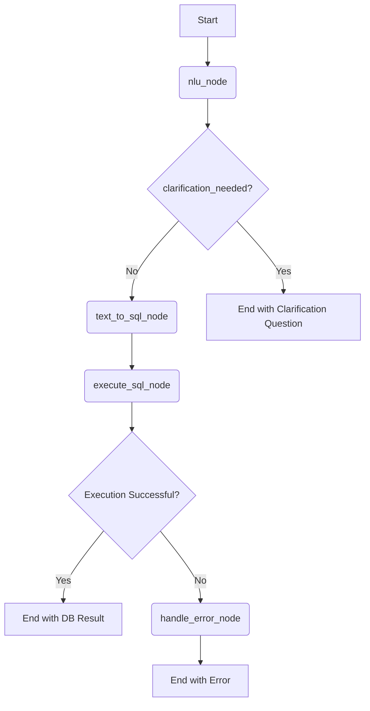

好的，我们来深入探讨一下这个方案。首先，你的技术选型非常棒，既现代又高效。使用 LangGraph 来编排这个流程是绝佳的选择，因为它天生就适合处理包含判断、循环（澄清追问）和状态管理的复杂工作流。

我们来详细梳理一下，并解答你关于 "Agent 还是 Graph Nodes" 的核心困惑。

### Agent 还是 Graph Nodes？核心概念梳理

这是个非常关键的问题。在 LangChain 的世界里，这两者不是互斥的，而是相辅相成的。

  * **Nodes (节点):** 是工作流中的**基本执行单元**。每个节点就是一个函数或一个可调用对象，负责执行一项具体任务，比如：调用Llama 3进行NLU、调用SQLCoder生成SQL、执行数据库查询等。
  * **Graph (图):** 是由节点（Nodes）和边（Edges）组成的**蓝图**。你通过定义节点，并用边来连接它们，从而规定了整个任务的执行流程和逻辑。
  * **Agent (代理):** Agent 的核心思想是\*\*“自主决策”\*\*。一个通用的 Agent 会被赋予一个目标和一套工具（Tools），然后由一个核心的LLM来决定在每一步应该调用哪个工具。这通常适用于流程不固定、需要模型在运行时动态选择工具的开放性任务。

**对于你的场景，答案是：**

你正在**使用 Graph 的节点（Nodes）和边（Edges）来构建一个高度专业化的、具有 Agentic（代理行为）特性的工作流**。

  * 你不需要一个通用的、每次都要思考“我该用哪个工具”的 Agent。因为你的流程是相对固定的：NLU -\> (可能澄清) -\> Text-to-SQL -\> 执行。
  * 你的“智能”和“决策”体现在图的**条件边（Conditional Edges）上。例如，在NLU节点之后，图会根据“是否需要澄清”这个状态来决定是走向“生成SQL”节点，还是回到“用户交互”这个环节。这个根据状态进行判断和路由**的行为，就是一种 Agentic 的表现。

所以，结论是：**专注于构建一个清晰的 Graph，你的 Graph 本身就会成为一个强大的、专为该任务设计的 Agent。**

-----

### 使用 LangGraph 的工作流设计

下面我们来设计这个工作流的蓝图，包括它的状态、节点和边。

#### 第一步：定义状态 (State)

State 是在整个图的执行过程中，贯穿所有节点的数据载体。我们需要一个字典或 TypedDict 来定义它。

```python
from typing import TypedDict, List, Optional

class GraphState(TypedDict):
    original_question: str      # 用户的原始问题
    nlu_result: Optional[dict]  # NLU的结果 (意图, 实体)
    clarification_needed: bool  # 是否需要澄清
    clarification_question: Optional[str] # 向用户追问的问题
    sql_query: Optional[str]    # 生成的SQL语句
    db_result: Optional[List[dict]] # 数据库查询的最终结果
    error_message: Optional[str] # 任何步骤的错误信息
```

#### 第二步：设计节点 (Nodes)

每个节点都是一个 Python 函数，接收 `state` 作为输入，并返回一个包含更新后字段的字典。

1.  **Node 1: `nlu_node` (自然语言理解)**

      * **输入:** `state['original_question']`
      * **工具:** 通过 `ollama` 调用 `Meta Llama 3`。
      * **任务:**
        1.  使用精心设计的 Prompt（参考我们上次的讨论），让 Llama 3 分析原始问题。
        2.  输出一个 JSON，包含意图、实体、以及一个判断（`clarification_needed`）和一个可能的追问（`clarification_question`）。
      * **输出:** 更新 `state` 中的 `nlu_result`, `clarification_needed`, `clarification_question`。

2.  **Node 2: `text_to_sql_node` (生成SQL)**

      * **输入:** `state['original_question']`, `state['nlu_result']`, 以及**数据库的 Schema**。
      * **工具:** 加载并调用 `defog/sqlcoder-7b-2` 模型。
      * **任务:**
        1.  将NLU的结果和数据库的 Schema 构造成一个高质量的 Prompt。SQLCoder 对 Schema 的格式有特定要求，需要遵循其文档来构造。
        2.  调用模型生成 SQL 查询语句。
      * **输出:** 更新 `state` 中的 `sql_query`。

3.  **Node 3: `execute_sql_node` (执行SQL)**

      * **输入:** `state['sql_query']`
      * **工具:** Python 的数据库连接库（如 `sqlite3`, `psycopg2`）。
      * **任务:**
        1.  连接数据库。
        2.  执行 `sql_query`。
        3.  获取结果并格式化为 JSON/List of Dicts。
        4.  **安全提示:** 这一步必须有严格的安全措施！绝不能直接执行由LLM生成的任何SQL。需要做白名单校验、权限控制或在一个只读的、隔离的环境中执行。
      * **输出:** 更新 `state` 中的 `db_result`。

4.  **Node 4: `handle_error_node` (错误处理)**

      * **输入:** 任何节点可能产生的错误。
      * **任务:** 格式化错误信息，方便返回给用户或记录日志。
      * **输出:** 更新 `state` 中的 `error_message`。

#### 第三步：定义边和图的结构 (Edges & Graph)

这是 LangGraph 的精髓所在。



**在 LangGraph 中的实现逻辑：**

1.  **设置入口点 (Entry Point):** `workflow.set_entry_point("nlu_node")`。
2.  **添加常规边 (Normal Edges):**
      * 从 `text_to_sql_node` 到 `execute_sql_node`。
3.  **添加条件边 (Conditional Edges):**
      * 在 `nlu_node` 之后，添加一个条件边，由一个 `decide_after_nlu` 函数来路由。
          * 如果 `state['clarification_needed']` 为 `True`，则路由到 `END` (或者一个专门的“追问”节点)。
          * 如果为 `False`，则路由到 `text_to_sql_node`。
      * 在 `execute_sql_node` 之后，也可以添加一个条件边来判断执行是否成功，从而决定是走向 `END` 还是 `handle_error_node`。

### 总结与优势

通过 LangGraph 这样构建，你可以获得一个：

1.  **清晰可控的流程：** 整个工作流的每一步都一目了然，方便调试和迭代。
2.  **强大的状态管理：** 所有信息都在 `state` 对象中传递，避免了复杂的函数传参。
3.  **内置的循环与重试：** “澄清追问”这个循环逻辑可以通过条件边轻松实现。你也可以轻松加入重试机制（例如，如果SQL生成失败，可以尝试用不同的Prompt重试）。
4.  **原子化的节点：** 每个节点只做一件事，你可以独立地优化或替换任何一个节点（比如未来将 Llama 3 换成 Llama 4，或者将 SQLCoder 换成其他模型），而不影响整个流程。
5.  **可视化与可观测性：** LangGraph 结合 LangSmith，可以让你完整地看到每一次执行的轨迹，哪个节点成功了，哪个失败了，状态是如何变化的，极大地方便了调试。

你的这个技术栈选择和用 LangGraph 来编排的想法完全正确且非常前沿。放心大胆地按照这个思路去构建吧！