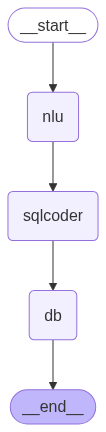
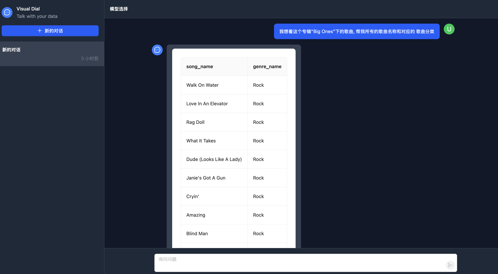
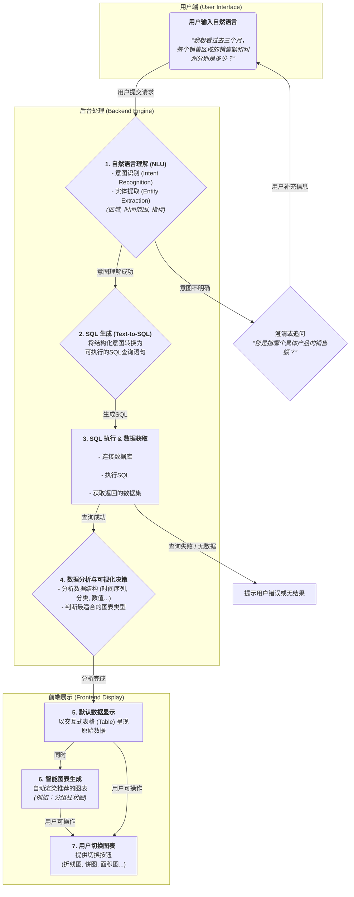

## 架构文档
[架构设计文档](./docs/architecture.md)

## Workflow graph

## case demo

## MVP diagram

```mermaid
graph TD
    subgraph "用户端 (User Interface)"
        A("
        <b>用户输入自然语言</b><br/>
        <i>“我想看过去三个月，每个销售区域的销售额和利润分别是多少？”</i>
        "):::userInput
    end

    subgraph "后台处理 (Backend Engine)"
        B{"<b>1. 自然语言理解 (NLU)</b><br/>- 意图识别 (Intent Recognition)<br/>- 实体提取 (Entity Extraction)<br/><i>(区域, 时间范围, 指标)</i>"}:::process
        C{"<b>2. SQL 生成 (Text-to-SQL)</b><br/>将结构化意图转换为<br/>可执行的SQL查询语句"}:::process
        D["
        <b>3. SQL 执行 & 数据获取</b><br/>
        - 连接数据库<br/>
        - 执行SQL<br/>
        - 获取返回的数据集
        "]:::db
        E{"<b>4. 数据分析与可视化决策</b><br/>- 分析数据结构 (时间序列, 分类, 数值...)<br/>- 判断最适合的图表类型"}:::process
    end

    subgraph "前端展示 (Frontend Display)"
        F["<b>5. 默认数据显示</b><br/>以交互式表格 (Table) 呈现原始数据"]:::output
        G["<b>6. 智能图表生成</b><br/>自动渲染推荐的图表<br/><i>(例如：分组柱状图)</i>"]:::output
        H["<b>7. 用户切换图表</b><br/>提供切换按钮<br/>(折线图, 饼图, 面积图...)"]:::output
    end

    %% 定义流程路径
    A -- "用户提交请求" --> B
    B -- "意图理解成功" --> C
    B -- "意图不明确" --> I{澄清或追问<br><i>“您是指哪个具体产品的销售额？”</i>}
    I -- "用户补充信息" --> A

    C -- "生成SQL" --> D
    D -- "查询成功" --> E
    D -- "查询失败 / 无数据" --> J[提示用户错误或无结果]

    E -- "分析完成" --> F
    F -- "同时" --> G
    G -- "用户可操作" --> H
    F -- "用户可操作" --> H
```