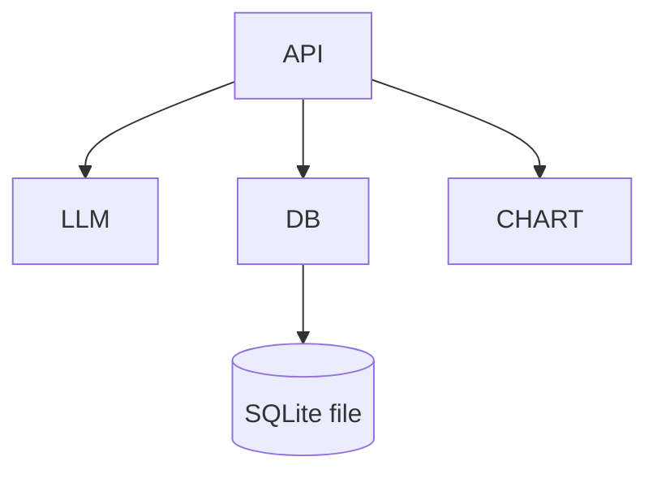

# Music Data Visualization Backend Architecture Document

## Introduction
This document outlines the backend architecture for the Music Data Visualization Platform. The system is designed for a minimal use case: trigger database queries via natural language, return structured results, and recommend chart types for visualization. There is no login, no permissions, and no audit log. The business domain is music: users, artists, albums, songs, and likes. The backend is optimized for local development and testing.

**Relationship to Frontend Architecture:**
Frontend is decoupled and interacts only via the /query API. All technology stack choices here are definitive for backend.

## Starter Template or Existing Project
N/A (handwritten minimal backend)

## Change Log
| Date       | Version | Description         | Author    |
|------------|---------|---------------------|-----------|
| 2025-07-26 | 1.0     | Initial version     | architect |

## High Level Architecture
### Technical Summary
- Monolithic FastAPI backend, single /query endpoint
- SQLite for persistent storage, SQLAlchemy ORM
- LLM (Ollama/qwen) for NL-to-SQL
- Chart type recommendation module
- No authentication, no audit log, no user management

### High Level Overview
- Style: Monolith
- Repo: Monorepo
- Service: RESTful API, no auth
- Flow: Frontend → /query (NL) → LLM → SQL → SQLite → result + chart type
- Key decisions: Simplicity, local dev, minimal dependencies

### High Level Project Diagram
```mermaid
graph TD
  FE[Frontend] --> API[FastAPI /query]
  API --> LLM[Ollama (qwen) LLM]
  API --> DB[SQLite]
  API --> CHART[Chart Recommendation]
```

### Architectural and Design Patterns
- **RESTful API:** Simple, stateless, easy to test
- **Repository Pattern:** SQLAlchemy for DB access
- **Adapter Pattern:** LLM client as adapter to Ollama

## Tech Stack
| Category      | Technology   | Version | Purpose                | Rationale                |
|--------------|--------------|---------|------------------------|--------------------------|
| Language     | Python       | 3.11    | Backend                | Simple, mature           |
| Framework    | FastAPI      | 0.110   | Web API                | Async, easy to use       |
| Database     | SQLite       | 3.x     | Local DB               | Zero config, file-based  |
| ORM          | SQLAlchemy   | 2.x     | DB access              | Declarative, robust      |
| LLM          | Ollama/qwen  | local   | NL-to-SQL              | Local, no API cost       |
| HTTP Client  | httpx        | 0.27    | LLM call               | Async, modern            |

## Data Models
### User
- id: int (PK)
- name: str

### Artist
- id: int (PK)
- name: str

### Album
- id: int (PK)
- title: str
- artist_id: int (FK)

### Song
- id: int (PK)
- title: str
- album_id: int (FK)
- artist_id: int (FK)

### Like
- id: int (PK)
- user_id: int (FK)
- song_id: int (FK)

## Components
### API Service
- /query POST: Accepts {question: str}, returns {data: [...], chartTypes: [...]}
- Calls LLM, executes SQL, recommends chart type

### LLM Client
- Adapts FastAPI to local Ollama (qwen) via HTTP
- Converts NL to SQL

### DB Layer
- SQLAlchemy ORM, SQLite file
- Handles all CRUD and query

### Chart Recommendation
- Simple rules: e.g., group-by → bar, count → pie, default → table

### Mock Data
- Script to populate users, artists, albums, songs, likes

### Component Diagram


## REST API Spec (OpenAPI 3.0)
```yaml
openapi: 3.0.0
info:
  title: Music Data Visualization API
  version: 1.0.0
servers:
  - url: http://localhost:8000
paths:
  /query:
    post:
      summary: Natural language query
      requestBody:
        required: true
        content:
          application/json:
            schema:
              type: object
              properties:
                question:
                  type: string
      responses:
        '200':
          description: Query result and chart types
          content:
            application/json:
              schema:
                type: object
                properties:
                  data:
                    type: array
                    items:
                      type: object
                  chartTypes:
                    type: array
                    items:
                      type: string
```

## Database Schema (SQLite)
```sql
CREATE TABLE user (
  id INTEGER PRIMARY KEY AUTOINCREMENT,
  name TEXT NOT NULL
);
CREATE TABLE artist (
  id INTEGER PRIMARY KEY AUTOINCREMENT,
  name TEXT NOT NULL
);
CREATE TABLE album (
  id INTEGER PRIMARY KEY AUTOINCREMENT,
  title TEXT NOT NULL,
  artist_id INTEGER,
  FOREIGN KEY(artist_id) REFERENCES artist(id)
);
CREATE TABLE song (
  id INTEGER PRIMARY KEY AUTOINCREMENT,
  title TEXT NOT NULL,
  album_id INTEGER,
  artist_id INTEGER,
  FOREIGN KEY(album_id) REFERENCES album(id),
  FOREIGN KEY(artist_id) REFERENCES artist(id)
);
CREATE TABLE like (
  id INTEGER PRIMARY KEY AUTOINCREMENT,
  user_id INTEGER,
  song_id INTEGER,
  FOREIGN KEY(user_id) REFERENCES user(id),
  FOREIGN KEY(song_id) REFERENCES song(id)
);
```

## Mock Data Script (Python)
```python
# mock_data.py
from db import SessionLocal, User, Artist, Album, Song, Like

def init_mock_data():
    db = SessionLocal()
    user = User(name="Alice")
    db.add(user)
    artist = Artist(name="Jay Chou")
    db.add(artist)
    album = Album(title="Fantasy", artist_id=1)
    db.add(album)
    song = Song(title="Simple Love", album_id=1, artist_id=1)
    db.add(song)
    like = Like(user_id=1, song_id=1)
    db.add(like)
    db.commit()
    db.close()
```

## Testing & Validation
- Run mock_data.py to populate the DB
- POST /query with questions like:
  - "Which artists does Alice like most?"
  - "How many songs per artist?"
  - "Who has the most albums?"
- Validate SQL generation, DB query, and chart type recommendation

---
For full FastAPI code or further detail, just ask.
